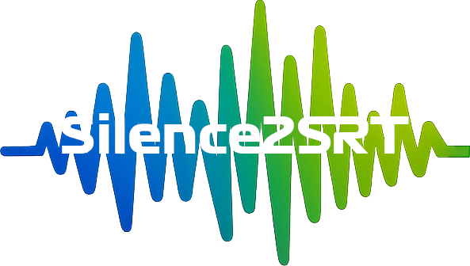

  

# Silence2SRT

Silence2SRT creates an .srt subtitles file from either silent or non-silent parts of an audio file.  Useful in video editting applications for quickly placing objects within the timeline.

The team radio graphic at 1:24 in this video was created with the help of Silence2SRT - https://www.youtube.com/watch?v=2LmSJkQ7lCs

https://www.youtube.com/@SimVRRacing
---

## Features
